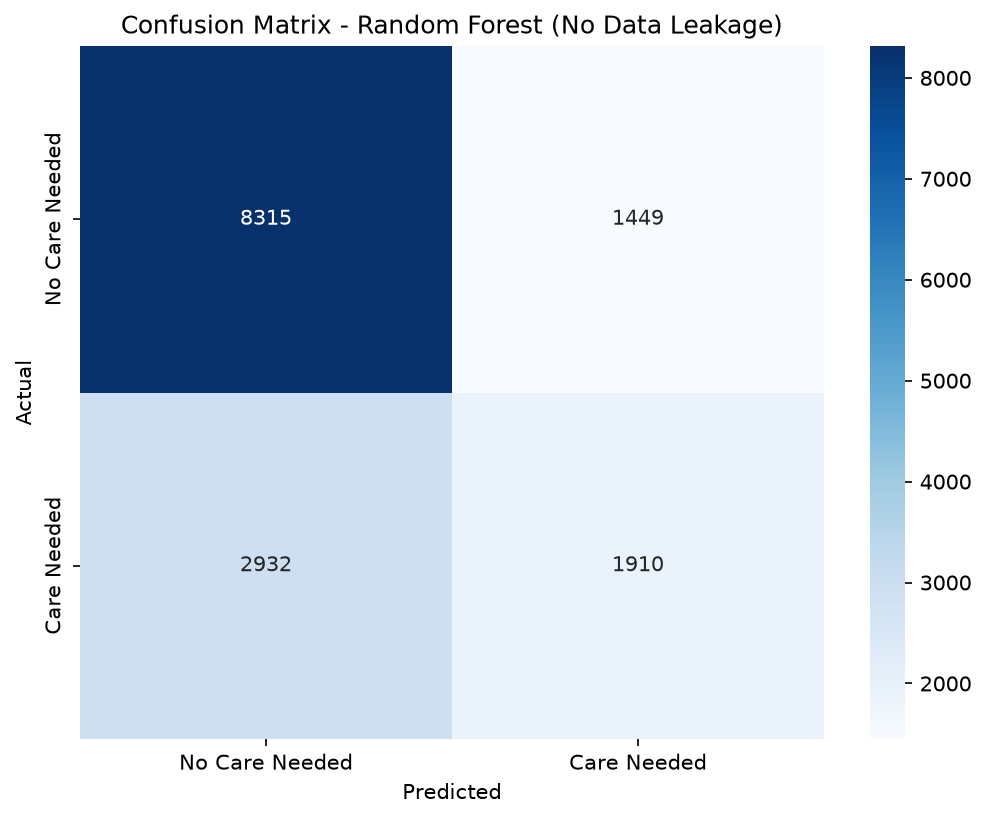
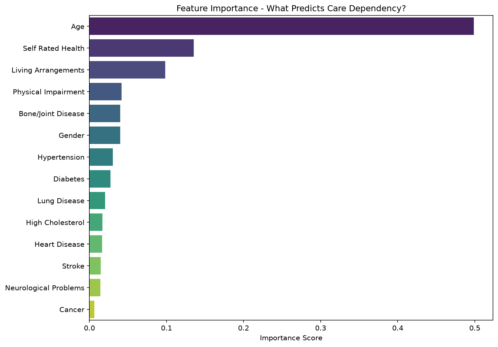

# Elderly Care Risk Prediction 🏥

A machine learning project to predict **care dependency risk** among elderly Indians using the LASI Wave 1 dataset. Built to identify which elderly individuals are most likely to need external caretaker support based on health, demographic, and social factors.

---

## 📌 Problem Statement

India has over 100 million elderly citizens, many of whom live with adult children who have migrated to cities for work. Identifying which elderly individuals are at risk of needing external care support is critical for:
- Proactive outreach by elder care platforms
- Resource planning for families and caregivers
- Policy decisions around social welfare schemes

---

## 📊 Dataset

**LASI Wave 1 (Longitudinal Ageing Study in India)**
- Source: International Institute for Population Sciences (IIPS), Mumbai
- Sample: 73,396 individuals aged 45+ across all Indian states and UTs
- Survey period: 2017–2018
- Access: Requires registration at [iipsdata.ac.in](https://iipsdata.ac.in)

> ⚠️ The raw dataset is not included in this repository due to data access restrictions. Apply for access at iipsdata.ac.in to reproduce this project.

---

## 🎯 Target Variable

`needs_care` — Binary variable (0/1) derived from ADL/IADL columns:
- **1** = Person has difficulty with 1 or more Activities of Daily Living (dressing, bathing, eating, shopping, managing money etc.)
- **0** = No difficulty reported

**Class distribution:** 67% No Care Needed / 33% Care Needed

---

## 🔬 Features Used

| Feature | Description |
|---|---|
| Age | Age at last birthday |
| Gender | Sex of respondent |
| Self Rated Health | Self-assessed health status (1=Excellent to 5=Poor) |
| Living Arrangements | Whether person lives alone, with spouse, children etc. |
| Physical Impairment | Any form of physical or mental impairment |
| Hypertension | Ever diagnosed with hypertension |
| Diabetes | Ever diagnosed with diabetes |
| Heart Disease | Ever diagnosed with chronic heart disease |
| Stroke | Ever diagnosed with stroke |
| Cancer | Ever diagnosed with cancer |
| Lung Disease | Ever diagnosed with chronic lung disease |
| Bone/Joint Disease | Ever diagnosed with bone or joint disease |
| Neurological Problems | Ever diagnosed with neurological/psychiatric problems |
| High Cholesterol | Ever diagnosed with high cholesterol |

---

## ⚠️ Key Learning: Data Leakage

An initial model achieved 100% accuracy — which was a red flag. The cause was **data leakage**: ADL/IADL columns were included as features even though they directly define the target variable. Removing these columns produced realistic and meaningful results (~70% accuracy, ROC AUC ~0.696).

---

## 📈 Results

| Metric | Score |
|---|---|
| Accuracy | 70% |
| ROC AUC | 0.696 |
| F1 (No Care Needed) | 0.79 |
| F1 (Care Needed) | 0.47 |

### Confusion Matrix


### Feature Importance


**Key finding:** Age is the strongest predictor of care dependency (importance score ~0.50), followed by self-rated health and living arrangements.

---

## 🛠️ Tech Stack

- Python 3.12
- pandas, numpy
- scikit-learn (Random Forest)
- matplotlib, seaborn
- pyreadstat (for reading STATA .dta files)

---

## 📁 Project Structure
elder-care-risk-prediction/
├── data/               # LASI .dta files (not tracked - gitignored)
├── notebooks/
│   └── eda.ipynb       # Full pipeline: EDA → cleaning → model → evaluation
├── outputs/
│   ├── eda_distributions.png
│   ├── confusion_matrix.png
│   └── feature_importance.png
├── .gitignore
├── LICENSE
└── README.md

---

## 🚀 How to Reproduce

1. Apply for LASI Wave 1 data access at [iipsdata.ac.in](https://iipsdata.ac.in)
2. Clone this repo
3. Place downloaded `.dta` files in the `data/` folder
4. Install dependencies:
```bash
pip install pandas numpy scikit-learn matplotlib seaborn pyreadstat
```
5. Open and run `notebooks/eda.ipynb` top to bottom

---

## 👤 Author

**Tushar Sekhri**
BTech Computer Science, IET Bhaddal Technical Campus, Ropar, Punjab
